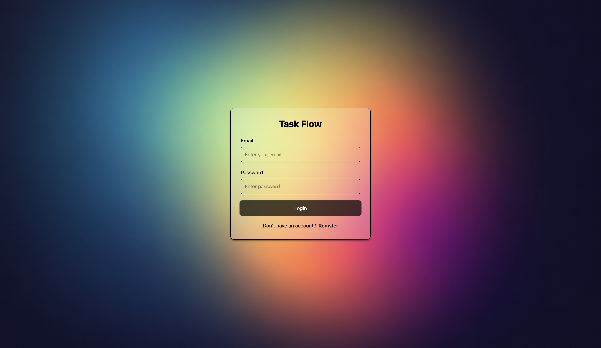
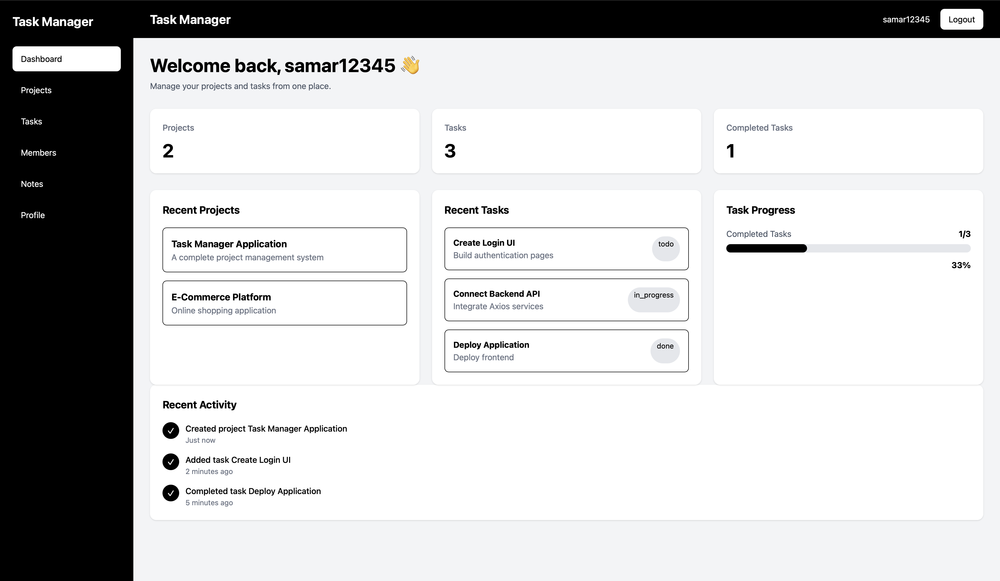
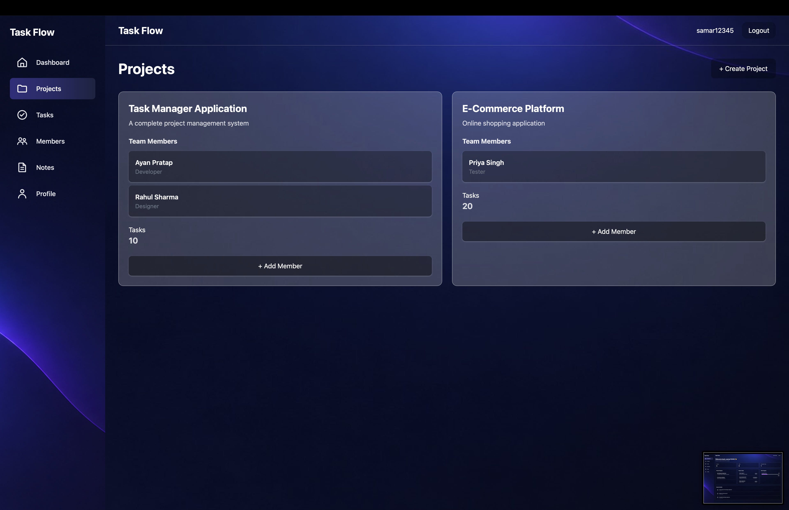
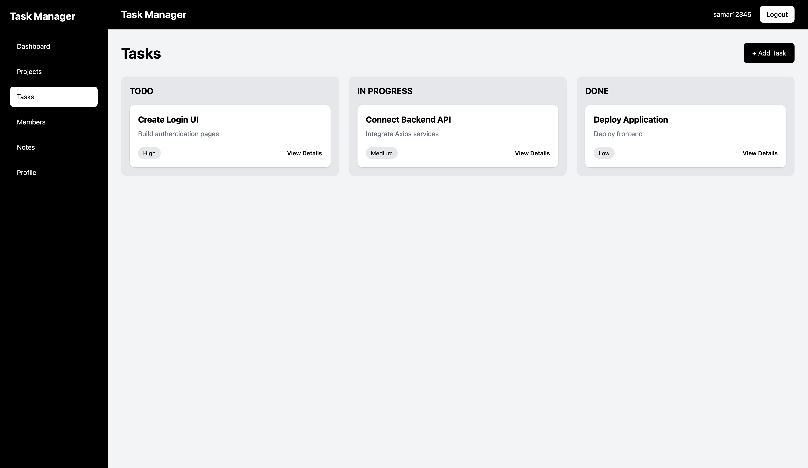
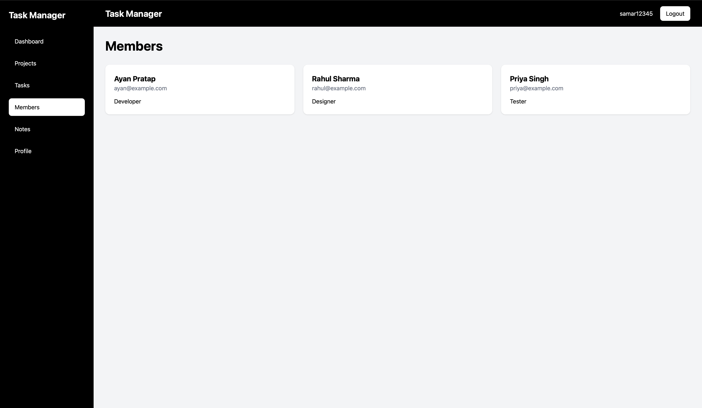
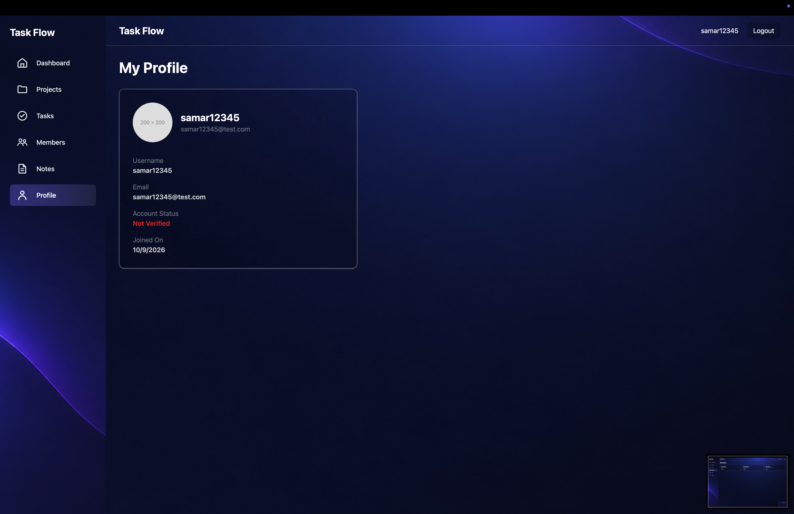

# 🚀 TaskFlow — Full-Stack Project Management Platform

<p align="center">
  <strong>A modern full-stack project management platform built with the MERN stack.</strong>
</p>

<p align="center">
  Manage projects, tasks, subtasks, and team members through a clean, responsive interface.
</p>

<p align="center">
  <a href="https://task-flow-jt79rbhvf-ayan-298e.vercel.app/login">
    
  </a>
  <a href="https://github.com/AyanPrt43/TaskFlow">
    
  </a>
</p>

---

# 📸 Application Screenshots

TaskFlow provides a modern and responsive interface for authentication, project management, task tracking, team collaboration, and user profile management.

---

## 🔐 Login

The authentication interface provides a clean and responsive login experience for users.

<p align="center">
  
</p>

---

## 📊 Dashboard

The dashboard provides an overview of projects, tasks, progress, recent activity, and other important information.

<p align="center">
  
</p>

---

## 📁 Projects

The Projects section allows users to view and manage their projects through an organized project interface.

<p align="center">
  
</p>

---

## ✅ Tasks

The Tasks section provides an organized workspace for viewing, creating, editing, assigning, and tracking tasks and subtasks.

<p align="center">
  
</p>

---

## 👥 Members

The Members section provides an interface for viewing and managing project team members and assigning members to tasks.

<p align="center">
  
</p>

---

## 👤 Profile

The Profile section provides users with their account and profile information.

<p align="center">
  
</p>

> **TaskFlow Dashboard** — A responsive project management interface for tracking projects, tasks, progress, and team activity.

---

## 🌐 Live Application

### 👉 [🚀 Visit TaskFlow Live Demo](https://task-flow-jt79rbhvf-ayan-298e.vercel.app/login)

Experience the deployed application and explore the authentication flow, dashboard, project management interface, task management, and responsive UI.

---

## ✨ Features

### 🔐 Authentication & Security

- User registration and login
- JWT-based authentication
- Access Token and Refresh Token architecture
- HTTP-only cookie-based authentication
- Password hashing with bcrypt
- Email verification workflow
- Protected API routes
- Protected frontend routes
- Current authenticated user retrieval
- Logout functionality
- Request validation
- Centralized API error handling

### 📋 Project Management

- Project dashboard
- Project cards
- Recent projects
- Project creation interface
- Team member management
- Member assignment interface
- Project-oriented task organization

### ✅ Task Management

- Create tasks
- Edit tasks
- Task details view
- Task columns
- Task cards
- Subtask management
- Task progress tracking
- Task assignment interface
- Activity timeline

### 🎨 Modern Frontend

- Responsive React.js interface
- Reusable component architecture
- React Context API
- React Router
- Axios API integration
- Tailwind CSS
- Toast notifications
- Protected navigation
- Responsive dashboard layout

---

# 🛠️ Tech Stack

## Frontend

<p>
  
  
  
  
</p>

- **React.js** — UI development
- **React Router** — Client-side routing
- **Tailwind CSS** — Styling and responsive design
- **Axios** — HTTP/API communication
- **React Context API** — State management
- **React Hot Toast** — Notifications
- **Vite** — Development and build tooling

## Backend

<p>
  
  
  
  
</p>

- **Node.js** — Server-side JavaScript runtime
- **Express.js** — REST API framework
- **MongoDB** — NoSQL database
- **Mongoose** — MongoDB ODM
- **JWT** — Authentication
- **bcrypt** — Password hashing
- **Express Validator** — Request validation
- **Nodemailer** — Email delivery
- **Mailgen** — Email template generation
- **CORS** — Cross-origin resource sharing
- **Cookie Parser** — Cookie handling

---

# 🏗️ Architecture

TaskFlow follows a separated **frontend/backend architecture**.

```text
                    ┌────────────────────────┐
                    │       React.js         │
                    │      Frontend UI       │
                    │    Tailwind CSS        │
                    └───────────┬────────────┘
                                │
                                │ Axios / HTTP
                                ▼
                    ┌────────────────────────┐
                    │      Express.js        │
                    │       REST API         │
                    └───────────┬────────────┘
                                │
               ┌────────────────┼────────────────┐
               │                │                │
               ▼                ▼                ▼
        ┌─────────────┐  ┌─────────────┐  ┌─────────────┐
        │ Controllers │  │  Middleware │  │ Validators  │
        └──────┬──────┘  └──────┬──────┘  └─────────────┘
               │                │
               └────────────────┘
                        │
                        ▼
                ┌───────────────┐
                │   Mongoose    │
                │ Models/Schemas│
                └───────┬───────┘
                        │
                        ▼
                ┌───────────────┐
                │    MongoDB    │
                └───────────────┘
```

---

# 🔐 Authentication Flow

TaskFlow uses JWT-based authentication with access and refresh tokens.

```text
                    User
                     │
                     ▼
              Register / Login
                     │
                     ▼
             Authentication API
                     │
          ┌──────────┴──────────┐
          │                     │
          ▼                     ▼
    Validate Request      Verify Credentials
                                │
                                ▼
                         bcrypt Verification
                                │
                                ▼
                         Generate JWT Tokens
                                │
                                ▼
                       HTTP-Only Cookies
                                │
                                ▼
                       Protected Request
                                │
                                ▼
                    Authentication Middleware
                                │
                                ▼
                          Verify JWT
                                │
                                ▼
                     Identify Authenticated User
```

---

# 📁 Project Structure

```text
TaskFlow/
│
├── src/
│   ├── controllers/
│   │   ├── auth-controller.js
│   │   └── healthcheck.controllers.js
│   │
│   ├── db/
│   │   └── index.js
│   │
│   ├── middlewares/
│   │   ├── auth.middleware.js
│   │   └── validators.middleware.js
│   │
│   ├── models/
│   │   ├── users.models.js
│   │   ├── project.models.js
│   │   ├── projectmember.models.js
│   │   ├── task.models.js
│   │   ├── sutask.models.js
│   │   └── note.models.js
│   │
│   ├── routes/
│   │   ├── auth.routers.js
│   │   └── healthcheck.route.js
│   │
│   ├── utils/
│   │   ├── api-error.js
│   │   ├── api-response.js
│   │   ├── async-handler.js
│   │   ├── constants.js
│   │   └── mail.js
│   │
│   ├── validators/
│   │   └── index.js
│   │
│   ├── app.js
│   └── index.js
│
├── public/
│   └── images/
│
├── task-manager-frontend/
│   ├── src/
│   │   ├── api/
│   │   ├── assets/
│   │   ├── components/
│   │   ├── context/
│   │   ├── services/
│   │   ├── App.jsx
│   │   └── main.jsx
│   │
│   ├── package.json
│   └── vite.config.js
│
├── screenshots/
│   └── dashboard.png
│
├── .gitignore
├── package.json
└── README.md
```

---

# 🔌 API

The backend API is versioned under:

```text
/api/v1
```

## Authentication Endpoints

| Method | Endpoint | Description |
|---|---|---|
| `POST` | `/auth/register` | Register a new user |
| `POST` | `/auth/login` | Authenticate user |
| `POST` | `/auth/logout` | Logout authenticated user |
| `POST` | `/auth/refresh-token` | Refresh access token |
| `POST` | `/auth/current-user` | Get current authenticated user |
| `GET` | `/auth/verify-email/:VerificationToken` | Verify email |
| `POST` | `/auth/resend-verification-email` | Resend verification email |
| `POST` | `/auth/forgot-password-request` | Request password reset |
| `POST` | `/auth/Forgot-password-reset/:ResetToken` | Reset password |
| `POST` | `/auth/change-current-password` | Change current password |

## Health Check

```text
GET /api/v1/healthcheck
```

---

# ⚙️ Environment Variables

Create a `.env` file in the backend root directory.

```env
PORT=3000

MONGO_URI=your_mongodb_connection_string

CORS_ORIGIN=http://localhost:5173

ACCESS_TOKEN_SECRET=your_access_token_secret
ACCESS_TOKEN_EXPIRY=your_access_token_expiry

REFRESH_TOKEN_SECRET=your_refresh_token_secret
REFRESH_TOKEN_EXPIRY=your_refresh_token_expiry

MAILTRAP_SMTP_HOST=your_smtp_host
MAILTRAP_SMTP_PORT=your_smtp_port
MAILTRAP_SMTP_USER=your_smtp_username
MAILTRAP_SMTP_PASS=your_smtp_password
```

⚠️ **Never commit your `.env` file or expose database, JWT, or email credentials.**

---

# 🚀 Installation & Setup

## 1. Clone the Repository

```bash
git clone https://github.com/AyanPrt43/TaskFlow.git
```

```bash
cd TaskFlow
```

---

## 2. Install Backend Dependencies

```bash
npm install
```

---

## 3. Configure Environment Variables

Create a `.env` file in the backend root directory and configure:

- MongoDB connection
- JWT secrets
- CORS origin
- Email service credentials
- Server port

---

## 4. Start Backend

### Development

```bash
npm run dev
```

### Production

```bash
npm start
```

Backend:

```text
http://localhost:3000
```

---

## 5. Start Frontend

Open another terminal:

```bash
cd task-manager-frontend
```

Install dependencies:

```bash
npm install
```

Start the development server:

```bash
npm run dev
```

Frontend:

```text
http://localhost:5173
```

---

# 🌐 Frontend API Configuration

TaskFlow uses Axios for communication between the React frontend and Express backend.

```javascript
import axios from "axios";

const api = axios.create({
    baseURL: "/api/v1",
    withCredentials: true,
    headers: {
        "Content-Type": "application/json"
    }
});

export default api;
```

The `withCredentials` configuration allows authentication cookies to be included with API requests.

---

# 🧩 Reusable React Components

TaskFlow follows a component-based architecture with reusable UI components.

Some of the major components include:

- `Navbar`
- `Sidebar`
- `ProjectCard`
- `RecentProjects`
- `RecentTasks`
- `TaskCard`
- `TaskColumn`
- `TaskDetailsModal`
- `CreateTaskModal`
- `EditTaskModal`
- `CreateProjectModal`
- `CreateSubtaskModal`
- `AssignMemberModal`
- `AddMemberModal`
- `MemberCard`
- `ActivityTimeline`
- `TaskProgress`
- `ProtectedRoute`

This structure improves **reusability, maintainability, and scalability** of the frontend.

---

# 🧠 Key Technical Concepts Demonstrated

This project demonstrates practical implementation of:

- MERN stack development
- RESTful API architecture
- JWT authentication
- Access/refresh token architecture
- HTTP-only cookies
- Password hashing
- MongoDB & Mongoose
- Express middleware
- Request validation
- Centralized error handling
- Centralized API responses
- React Context API
- React Router
- Axios
- Tailwind CSS
- Protected routes
- Reusable React components
- Environment-based configuration
- Email verification
- Frontend/backend separation

---

# 📸 More Screenshots

Additional screenshots can be added to the `screenshots` directory.

### Dashboard


### Project Management


### Task Management


### Task Details


---

# 🔮 Future Improvements

- Complete project and task CRUD API integration
- Role-based access control
- Advanced project permissions
- Real-time task updates
- Search and filtering
- Task priorities and deadlines
- File and image attachments
- Dashboard analytics
- Notification system
- Automated testing
- CI/CD pipeline
- Production deployment improvements

---

# 👨‍💻 Author

## Ayan Pratap

**B.Tech Computer Science & Engineering**

<p>
  <a href="https://github.com/AyanPrt43">
    
  </a>
</p>

---

# ⭐ Show Your Support

If you found TaskFlow interesting, consider giving the repository a ⭐.

Your feedback and suggestions are always welcome!

---

## 📄 License

This project is currently developed for educational and portfolio purposes.